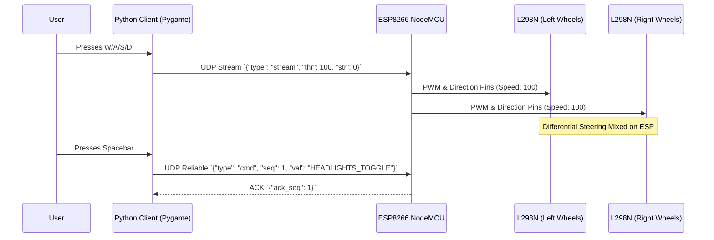
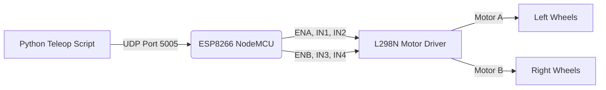

# RC Car Teleoperation System

A Python and ESP8266-based RC car teleoperation system with a Skid-Steer (Tank Drive) setup.

## 🎥 Demo
[Watch the RC Car in action!](https://drive.google.com/file/d/1298T6hJaPL8kEGePPkBc9YoJcaaSTVhx/view?usp=drive_link)

## 🏗️ Architecture & Workflow

The system uses a UDP-based protocol where a Python Pygame application reads keyboard input and sends JSON payloads to an ESP8266 (NodeMCU) over Wi-Fi.

## 🛠️ Technicals
*(Note: Be sure to upload your images (UI, IDE, hardware) into an `images/` folder in the repository so these display correctly once pushed to GitHub.)*

### Teleop UI

### Arduino IDE Code

### Hardware Setup

## 🚀 Running the System
1. Flash `sketch_sep12a.ino` to your NodeMCU.
2. Connect to the same network.
3. Run the Python client: `python rc.py`
4. Make sure the Pygame window is focused and use `WASD` to drive.
